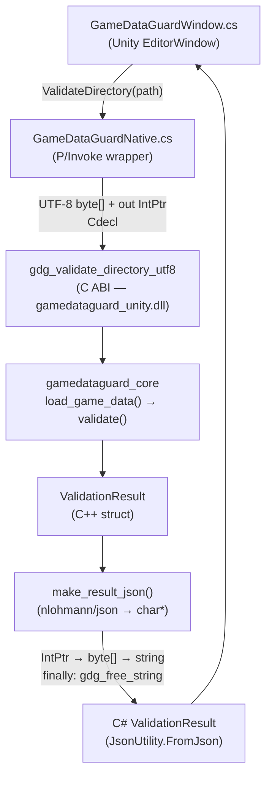

# GameDataGuard

**GameDataGuard** is a C++17 game-data validation and packaging tool. It loads structured game data—NPCs, items, quests, and localization files—detects content problems before they reach a runtime build, and can package the validated data into a deterministic binary asset container. The tool is accessible both as a command-line executable and through a native Unity Editor integration.

> **Scope:** Individual portfolio project with a production-inspired design. Developed to demonstrate C++17 game-development tooling, native plugin development, C#–C++ interoperability, graph analysis, deterministic packaging, automated testing, and CI/CD integration.

---

## At a Glance

| Property | Value |
|---|---|
| Core language | C++17 |
| Scripting integration | C# (Unity Editor) |
| Native interface | C ABI (`extern "C"`, P/Invoke, `Cdecl`) |
| Interfaces | CLI executable, Unity EditorWindow |
| Validation coverage | Cross-references, duplicate IDs, numeric ranges, localization completeness, quest-graph cycles and reachability |
| Output formats | Console diagnostics, JSON report (`.json`), binary asset pack (`.gdgpack`) |
| Test framework | Catch2 v3.5.4 |
| Build system | CMake 3.21+, FetchContent |
| CI | GitHub Actions (Ubuntu/GCC, Windows/MSVC), Jenkins |
| Tested platforms | Windows x64 (core + Unity plugin), Linux x64 (core CLI) |

---

## Unity Editor Integration

Game designers frequently edit quest chains, NPC references, and localization files in external tools. Catching broken references or unreachable content after a full runtime build is slow. The Unity integration surfaces GameDataGuard validation directly inside the Unity Editor, before any build step.

The **GameDataGuard EditorWindow** is opened via **Tools → GameDataGuard**. It does not require Play Mode. The user provides a game-data directory path, clicks **Validate**, and sees a structured result with per-diagnostic error icons in a scrollable list.

### Screenshots

**Successful validation — `sample_data/valid`**


*Status banner shows PASSED. The diagnostic list is empty.*

---

**Validation error — missing NPC reference (GDG006)**


*The quest at index 0 references an NPC ID that does not exist. The exact JSON pointer and diagnostic code are shown inline.*

---

**Validation error — quest graph cycle (GDG013)**


*The DFS-based cycle detector reports the full cycle path: `quest_final → quest_intro → quest_forest → quest_final`.*

### Unity workflow

1. Build the native plugin: `cmake -B build -DGDG_BUILD_UNITY_PLUGIN=ON && cmake --build build --config Release --target gamedataguard_unity`
2. Copy the plugin to the Unity project: `.\integrations\unity\scripts\copy_plugin.ps1`
3. Open the Unity project at `integrations/unity/GameDataGuardUnity/`
4. In the Unity Editor menu, select **Tools → GameDataGuard**
5. Type a path directly in the **Game Data Directory** field, or click **Select Directory**
6. Click **Validate** — disabled until a path is entered
7. Review the status banner and scrollable diagnostic list

---

## Native C++ and C# Boundary

The Unity integration uses a thin C ABI bridge compiled as a separate Windows shared library (`gamedataguard_unity.dll`). The C++ core and all STL types stay behind that boundary; only two C functions are exported.

### Exported API

```c
// Returns 0 (passed), 1 (validation errors), or 2 (tool/input failure).
// Always sets *result_json_utf8 to a heap-allocated NUL-terminated UTF-8 string.
// Caller must release via gdg_free_string().
int32_t gdg_validate_directory_utf8(const char* directory_path_utf8,
                                    char**      result_json_utf8);

// Releases memory allocated by gdg_validate_directory_utf8.
// Passing NULL is safe.
void gdg_free_string(char* value);
```

### JSON result schema

```json
{
  "status":       "passed" | "validation_failed" | "tool_error",
  "errorCount":   1,
  "warningCount": 0,
  "message":      "",
  "diagnostics": [
    {
      "severity": "error",
      "code":     "GDG006",
      "file":     "quests.json",
      "path":     "/0/giver_npc_id",
      "message":  "Referenced NPC \"npc_does_not_exist\" does not exist."
    }
  ]
}
```

`severity` is lower-case to follow idiomatic JSON conventions. The CLI reporter uses upper-case independently. `path` is always a string — empty when no JSON pointer applies, so `JsonUtility` does not need to handle JSON `null`.

### Data flow



### Memory and error contract

- The native layer allocates result strings with `new char[]`; `gdg_free_string` calls `delete[]`. `gdg_free_string(nullptr)` is a no-op.
- The native buffer is always released in a C# `finally` block — unconditionally, regardless of exceptions or early returns.
- The path is passed as a `byte[]` pre-encoded to UTF-8, with an explicit `\0` terminator. This avoids relying on `CharSet.Ansi` (which uses the system code page) and works across both Mono and IL2CPP scripting backends.
- Every exception type at the interop boundary (`DllNotFoundException`, `EntryPointNotFoundException`, `BadImageFormatException`, and a general catch-all) is converted to a `tool_error` result. `ValidateDirectory` never throws.
- All C++ exceptions are caught inside the native layer. Nothing propagates into managed code.

### Plugin placement and loading

The DLL must be at `Assets/Plugins/x86_64/gamedataguard_unity.dll` with the Plugin Inspector configured as follows: **Any Platform** unchecked, **Editor** checked, **Windows x86_64** checked. The integration is editor-only and has no runtime or player-build support.

---

## Unity Setup and Usage

**Requirements:** Windows x64, MSVC 2019+, CMake 3.21+, Unity Editor (the project was developed and verified in Unity 6).

### Step 1 — Build the native plugin

From the repository root, in a Developer Command Prompt for VS 2022:

```cmd
cmake -B build -DGDG_BUILD_UNITY_PLUGIN=ON
cmake --build build --config Release --target gamedataguard_unity
```

This produces `build\Release\gamedataguard_unity.dll`.

### Step 2 — Copy the plugin into the Unity project

```powershell
.\integrations\unity\scripts\copy_plugin.ps1
```

Close Unity before running this step if the project is already open, because Unity holds a file lock on loaded native plugins. The script verifies the source DLL exists and warns if a Unity lock file is detected.

Default parameters: `-Configuration Release -BuildDir build`. Adjust as needed:

```powershell
.\integrations\unity\scripts\copy_plugin.ps1 -Configuration Debug -BuildDir build_debug
```

### Step 3 — Open the Unity project

Open `integrations/unity/GameDataGuardUnity/` in the Unity Editor. The plugin will be re-imported automatically.

### Step 4 — Configure the Plugin Inspector

Select `Assets/Plugins/x86_64/gamedataguard_unity.dll` in the Project window:

- **Any Platform**: unchecked
- **Editor**: checked
- **Windows > x86_64**: checked
- Click **Apply**

### Step 5 — Use the EditorWindow

1. Select **Tools → GameDataGuard** from the Unity menu
2. Enter a path or click **Select Directory**
3. Click **Validate**

To test with the included sample data: point the directory field at `sample_data/valid` (passes) or `sample_data/invalid/missing_reference` (fails with GDG006).

---

## Problem Being Solved

Game studios accumulate structured data files that are edited continuously by designers and writers. Common problems that must be caught before the runtime build:

- **Broken references**: a quest references an NPC ID that was renamed or removed
- **Duplicate IDs**: two entities share the same ID, causing undefined behavior at runtime
- **Missing localization**: a key exists in English but not in Japanese or Hebrew
- **Invalid numeric values**: an NPC has `max_hp: 0`, or an item has a negative price
- **Quest graph cycles**: `quest_a → quest_b → quest_a` hangs progression logic
- **Unreachable quests**: content that can never be reached from any start quest
- **Suspicious economic values**: sell price exceeds buy price (warning, not error)

GameDataGuard catches these at CI time and reports each problem with a stable code, source file, JSON pointer, and human-readable message.

---

## Key Capabilities

- Stable diagnostic codes **GDG001–GDG017** across all output formats
- Cross-reference validation: NPC/item/quest IDs across all data files
- Duplicate ID detection for NPCs, items, quests, and localization keys
- Numeric-range validation for HP, attack, defense, and price fields
- Localization completeness checking across all required locales
- Quest-graph **cycle detection** using depth-first search (DFS coloring)
- Quest-graph **reachability analysis** from configured start quests
- Structured **JSON diagnostic reports** (`--report` flag)
- Deterministic **binary asset packaging** (`.gdgpack` format)
- `--warnings-as-errors` mode for strict CI enforcement
- Clean exit codes for shell and pipeline integration
- **Unity EditorWindow** as a native-plugin interface to the same validation core

---

## Demonstration

```
$ gamedataguard validate sample_data/valid
Validation passed: no errors, no warnings.

$ gamedataguard validate sample_data/invalid/missing_reference

ERROR GDG006 [quests.json:/0/giver_npc_id]
Referenced NPC "npc_does_not_exist" does not exist.

Validation failed: 1 error, 0 warnings.

$ gamedataguard validate sample_data/invalid/quest_cycle

ERROR GDG013 [quests.json]
Quest graph cycle detected: quest_final -> quest_intro -> quest_forest -> quest_final

Validation failed: 1 error, 0 warnings.

$ gamedataguard build sample_data/valid output.gdgpack --report report.json
Validation passed: no errors, no warnings.
Pack written: output.gdgpack

$ gamedataguard validate sample_data/invalid/unused_localization --warnings-as-errors

WARNING GDG015 [localization/en.json:/unused.key]
Unused localization key "unused.key" in locale "en".

Validation passed with 1 warning.
$ echo $?
1
```

---

## Architecture

```
                ┌─────────────────────────────────┐
                │   Unity EditorWindow (C#)        │
                │   GameDataGuardWindow.cs          │
                └────────────┬────────────────────┘
                             │ P/Invoke (Cdecl, UTF-8 byte[])
                ┌────────────▼────────────────────┐
                │  C ABI bridge                    │
                │  gamedataguard_unity.dll          │
                └────────────┬────────────────────┘
                             │ calls C++ core directly
          ┌──────────────────▼──────────────────────────┐
          │            gamedataguard_core                │
          │  DataLoader → Validator → QuestGraph         │
          └──────────────────┬──────────────────────────┘
                             │
          ┌──────────────────┴───────────────────────────┐
          │  CLI (main.cpp)     │  JsonReporter           │
          │  Console output     │  Packer (.gdgpack)      │
          └─────────────────────────────────────────────┘
```

The validation core is independent of both the CLI and Unity. The CLI and the native plugin each call the same `load_game_data()` and `validate()` functions directly. Presentation logic stays in the consumer layer — the core never prints to stdout or writes files.

See [docs/architecture.md](docs/architecture.md) for component responsibilities, data flow, and design rationale.

---

## Repository Structure

```
GameDataGuard/
├── CMakeLists.txt
├── README.md
├── LICENSE
├── Jenkinsfile
├── include/gamedataguard/          # C++ public headers
│   ├── cli.hpp
│   ├── data_loader.hpp
│   ├── data_model.hpp
│   ├── diagnostic.hpp
│   ├── json_reporter.hpp
│   ├── packer.hpp
│   ├── quest_graph.hpp
│   ├── validation_result.hpp
│   └── validator.hpp
├── src/                            # C++ implementations
│   ├── main.cpp
│   ├── cli.cpp
│   ├── data_loader.cpp
│   ├── diagnostic.cpp
│   ├── json_reporter.cpp
│   ├── packer.cpp
│   ├── quest_graph.cpp
│   ├── validation_result.cpp
│   └── validator.cpp
├── integrations/
│   └── unity/
│       ├── native/
│       │   ├── gamedataguard_unity.h    # exported C ABI
│       │   └── gamedataguard_unity.cpp  # bridge implementation
│       ├── GameDataGuardUnity/          # Unity project
│       │   └── Assets/
│       │       ├── Editor/
│       │       │   ├── GameDataGuardModels.cs   # C# data models
│       │       │   ├── GameDataGuardNative.cs   # P/Invoke wrapper
│       │       │   └── GameDataGuardWindow.cs   # EditorWindow
│       │       └── Plugins/x86_64/
│       │           └── gamedataguard_unity.dll  # built separately
│       └── scripts/
│           └── copy_plugin.ps1          # deploys DLL to Unity project
├── tests/
│   ├── CMakeLists.txt
│   ├── unity_bridge_tests.cpp      # 10 C ABI tests (no Unity required)
│   ├── cli_tests.cpp
│   ├── data_loader_tests.cpp
│   ├── packer_tests.cpp
│   ├── quest_graph_tests.cpp
│   ├── validator_tests.cpp
│   └── test_helpers/temp_dir.hpp
├── sample_data/
│   ├── valid/                      # 3 NPCs, 4 items, 5 quests, en/ja/he
│   └── invalid/
│       ├── duplicate_id/
│       ├── missing_reference/
│       ├── missing_localization/
│       ├── quest_cycle/
│       ├── unreachable_quest/
│       ├── invalid_numbers/
│       ├── unused_localization/
│       └── malformed_json/
├── docs/
│   ├── architecture.md
│   ├── validation-reference.md
│   └── images/unity/
└── .github/workflows/ci.yml
```

---

## Build Instructions

### Core CLI (Windows and Linux)

**Windows** — open a Developer Command Prompt for VS 2022:

```cmd
git clone https://github.com/OmriL997/GameDataGuard.git
cd GameDataGuard

cmake -B build -DCMAKE_BUILD_TYPE=Release
cmake --build build --config Release --parallel

build\Release\gamedataguard.exe validate sample_data\valid
```

**Linux:**

```bash
git clone https://github.com/OmriL997/GameDataGuard.git
cd GameDataGuard

cmake -B build -DCMAKE_BUILD_TYPE=Release
cmake --build build --parallel

./build/gamedataguard validate sample_data/valid
```

The first build downloads nlohmann/json v3.11.3 and Catch2 v3.5.4 via CMake FetchContent.

### Unity native plugin (Windows only)

```cmd
cmake -B build -DGDG_BUILD_UNITY_PLUGIN=ON
cmake --build build --config Release --target gamedataguard_unity
```

Then run the deploy script (see [Unity Setup and Usage](#unity-setup-and-usage)).

### CMake options

| Option | Default | Description |
|---|---|---|
| `GDG_BUILD_UNITY_PLUGIN` | OFF | Build `gamedataguard_unity.dll` (Windows only) |
| `GDG_WARNINGS_AS_ERRORS` | OFF | Treat compiler warnings as errors |
| `GDG_ENABLE_SANITIZERS` | OFF | AddressSanitizer + UBSan (GCC/Clang only) |

---

## CLI Usage

```
gamedataguard validate <data_directory> [options]
gamedataguard build    <data_directory> <output_pack> [options]
gamedataguard help
gamedataguard --help | -h

Options:
  --report <path>      Write a JSON diagnostic report to <path>.
  --warnings-as-errors Treat warnings as errors (exit code 1 on any warning).
```

**Exit codes:**

| Code | Meaning |
|---|---|
| 0 | Validation passed, or pack built successfully |
| 1 | Validation errors found, or warnings with `--warnings-as-errors` |
| 2 | Usage error, unreadable file, malformed JSON, or internal failure |

Malformed JSON returns exit code 2 — it is a tool/input failure, not a content validation failure.

---

## Input Data Format

```
data_directory/
├── manifest.json
├── npcs.json
├── items.json
├── quests.json
└── localization/
    ├── en.json
    ├── ja.json
    └── he.json
```

**manifest.json**

```json
{
  "schema_version": 1,
  "required_locales": ["en", "ja", "he"],
  "start_quest_ids": ["quest_intro"]
}
```

**npcs.json** — root array

```json
[{ "id": "npc_guide", "name_key": "npc.guide.name",
   "max_hp": 100, "attack": 10, "defense": 5 }]
```

**items.json** — root array

```json
[{ "id": "item_potion", "name_key": "item.potion.name",
   "description_key": "item.potion.description",
   "buy_price": 50, "sell_price": 20 }]
```

**quests.json** — root array

```json
[{ "id": "quest_intro", "title_key": "quest.intro.title",
   "description_key": "quest.intro.description",
   "giver_npc_id": "npc_guide",
   "reward_item_ids": ["item_potion"],
   "next_quest_ids": ["quest_second"] }]
```

**Localization files** — JSON object mapping keys to UTF-8 strings

```json
{ "npc.guide.name": "Guide", "item.potion.name": "Potion" }
```

---

## Validation Rules and Diagnostic Codes

A summary of what is checked:

| Area | Rules |
|---|---|
| Manifest | Schema version = 1; non-empty unique locales; non-empty start quest IDs; each start quest must exist |
| NPCs | Unique non-empty IDs; `max_hp` 1–999999; `attack`/`defense` 0–999999 |
| Items | Unique non-empty IDs; prices ≥ 0; sell > buy raises a warning |
| Quests | Unique non-empty IDs; all references valid; no duplicate IDs in arrays; no self-references; no cycles; all quests reachable |
| Localization | All required locale files present; all referenced keys present; values non-empty and non-whitespace; unused keys produce warnings |

For the full rule-by-rule breakdown and complete diagnostic code table (GDG001–GDG017), see [docs/validation-reference.md](docs/validation-reference.md).

---

## Binary Package Format

The `build` command produces a `.gdgpack` binary file:

| Offset | Size | Type | Content |
|---|---|---|---|
| 0 | 4 bytes | ASCII | Magic: `GDG1` |
| 4 | 4 bytes | uint32_t LE | Format version: `1` |
| 8 | 8 bytes | uint64_t LE | Payload byte count |
| 16 | N bytes | UTF-8 | Canonical JSON payload |

The payload contains all validated data under keys `manifest`, `npcs`, `items`, `quests`, and `localization`. All arrays and maps are sorted to guarantee **byte-identical output for identical input** across repeated builds: NPCs/items/quests sorted by `id`; `required_locales`, `start_quest_ids`, `reward_item_ids`, `next_quest_ids` sorted; localization keys and locale names sorted via `std::map` iteration order.

Integer fields are written little-endian. The payload is not compressed. The file is written atomically via a `.tmp` rename — a partially written pack never appears at the destination path.

---

## Testing

The test suite uses Catch2 and is registered with CTest. Tests use RAII temporary directories and the `GDG_SAMPLE_DATA_DIR` compile definition; they do not depend on the current working directory.

**Core C++ tests (67 test cases):**

- `cli_tests.cpp` — argument parsing, option handling, error cases
- `data_loader_tests.cpp` — valid data loads, malformed JSON, missing files, type errors
- `validator_tests.cpp` — every validation rule path, all 8 invalid sample datasets
- `quest_graph_tests.cpp` — cycles, reachability, self-references, empty graphs
- `packer_tests.cpp` — magic bytes, format version, payload size, JSON roundtrip, deterministic output, atomic write failure

**Unity bridge tests (10 test cases, `unity_bridge_tests.cpp`):**

Tests call the exported C functions directly without Unity running. Covered: status codes for valid/invalid/missing paths; JSON schema completeness; `errorCount`/`warningCount` consistency with the diagnostics array; lower-case severity strings; `gdg_free_string(nullptr)` safety; repeated calls for state-leak detection.

**What is manually verified:** Unity EditorWindow layout and behavior — shown in the screenshots above. No automated Unity Editor tests exist.

**Run the C++ tests:**

```bash
cmake -B build -DCMAKE_BUILD_TYPE=Debug
cmake --build build --parallel
ctest --test-dir build --output-on-failure

# With sanitizers (GCC/Clang):
cmake -B build -DCMAKE_BUILD_TYPE=Debug -DGDG_ENABLE_SANITIZERS=ON
cmake --build build --parallel
ctest --test-dir build --output-on-failure

# Unity bridge tests (Windows, requires GDG_BUILD_UNITY_PLUGIN=ON):
cmake -B build -DGDG_BUILD_UNITY_PLUGIN=ON
cmake --build build --parallel
ctest --test-dir build --output-on-failure
```

---

## CI and Jenkins

### GitHub Actions

The `.github/workflows/ci.yml` workflow runs on every push and pull request.

| Matrix job | OS | Compiler | Config | Sanitizers |
|---|---|---|---|---|
| Ubuntu GCC | ubuntu-latest | GCC | Release | No |
| Ubuntu GCC + sanitizers | ubuntu-latest | GCC | Debug | ASan + UBSan |
| Windows MSVC | windows-latest | MSVC | Release | No |

All jobs build with `GDG_WARNINGS_AS_ERRORS=ON`. The Windows job additionally builds with `GDG_BUILD_UNITY_PLUGIN=ON` and uploads `gamedataguard_unity.dll` as an artifact (`gamedataguard-unity-plugin-windows-x64`). Each job also validates `sample_data/valid` and builds a sample `.gdgpack`.

The Unity EditorWindow is not tested in CI — only the native DLL is built and uploaded.

### Jenkinsfile

The declarative `Jenkinsfile` demonstrates a cross-platform internal pipeline with stages: Checkout → Configure → Build → Test → Validate Sample Data → Package Sample Data → Archive Artifacts. Agent type is detected at runtime using `isUnix()`.

---

## Engineering Decisions

**Separation of validation and presentation.** `validate()` returns a `ValidationResult` containing all diagnostics. It never prints. The CLI and the Unity EditorWindow both call the same function and format output independently. This makes unit testing straightforward and prevents the core from acquiring engine-specific dependencies.

**`LoadResult` as `std::variant<LoadSuccess, LoadError>`.** Fatal loading failures (missing file, malformed JSON) are structurally distinct from validation errors. The call site must handle both cases explicitly. This maps cleanly to the two exit codes (1 = validation failure, 2 = tool failure).

**`std::map` for localization data.** Using `std::map<string, string>` instead of `unordered_map` guarantees sorted key iteration in the packer payload without a separate sort step.

**Atomic file writes.** Both the JSON reporter and the packer write to a `.tmp` file and rename atomically. A partially written file never appears at the intended destination.

**Deterministic cycle path in diagnostics.** The DFS stack maintains the current traversal path, allowing cycle messages to include the full path (e.g., `quest_a → quest_b → quest_a`) rather than just identifying two adjacent nodes.

**C-compatible ABI for the Unity plugin.** Exporting `extern "C"` functions eliminates C++ name mangling and ABI fragility. The managed side does not need to know the C++ types, allocators, or exception model. The ABI surface is intentionally minimal: one validation function and one free function.

**Memory ownership made explicit.** The native layer allocates the result string; the header documents that the caller must free it via `gdg_free_string`. The C# wrapper releases it unconditionally in a `finally` block, decoupling ownership from control flow.

**Unity presentation stays outside the core.** The EditorWindow formats and renders results entirely in C#. The C++ core has no knowledge of Unity types, IMGUI, or engine conventions.

**No global mutable state.** All state is parameter-passed or locally owned. The validation functions are safe to call repeatedly from any context, including the repeated-call test in the bridge test suite.

---

## Challenges and What I Learned

**Exposing a C++ core through a stable native boundary.** The existing `gamedataguard_core` static library was designed without a DLL export in mind. Adding the bridge required defining a minimal C ABI, deciding which types stay native (all of them), and serialising results to JSON for transfer — rather than trying to expose C++ structs directly.

**Marshaling results from unmanaged to managed code.** Unity's `JsonUtility` does not handle JSON `null`, optional fields, or arbitrary object shapes. This required deliberately designing the native JSON schema so that all fields are always present (empty string for absent optional values, empty array for absent diagnostic lists).

**UTF-8 string encoding at the P/Invoke boundary.** Passing strings as `byte[]` rather than relying on `CharSet.Ansi` was necessary to ensure UTF-8 paths work correctly regardless of the Windows system code page. This was verified with paths containing non-ASCII characters in the sample localization data.

**Native library placement and the Plugin Inspector.** Unity resolves `DllImport("gamedataguard_unity")` to `Assets/Plugins/x86_64/gamedataguard_unity.dll` only when the Plugin Inspector is configured correctly. An incorrect setting produces a `DllNotFoundException` at runtime with no visual indication in the Editor — this is caught and surfaced as a `tool_error` result in the UI.

**Keeping the core independent.** The validation logic, quest-graph analysis, and packaging code required no modification to support the Unity integration. The bridge is additive — a separate CMake target, a separate source file, and a separate test executable.

---

## Development Scope

Individual portfolio project developed in 2026. Production-inspired but portfolio-scale — not deployed in a shipping title.

**Components implemented:**

- C++ validation core (data loading, validation rules, graph analysis)
- Deterministic binary packer
- JSON diagnostic reporter
- CLI executable
- C ABI native plugin bridge
- C# P/Invoke wrapper and EditorWindow
- Automated test suite (core + Unity bridge)
- CMake build configuration for all targets
- GitHub Actions CI (multi-platform matrix)
- Jenkins declarative pipeline
- PowerShell deploy script

---

## Known Limitations

- The Unity native plugin is built and tested on **Windows x64 only**. No Linux or macOS Unity integration exists.
- The DLL must be copied manually using `copy_plugin.ps1`. There is no automated build step that integrates with Unity's package import process.
- There are no automated Unity Editor tests — Unity Editor behavior is verified manually.
- The Plugin Inspector must be configured by hand after each fresh Unity project open; there is no `.meta` file that permanently encodes the correct settings in a portable way.
- The cycle detector reports the first cycle found in DFS order. If multiple independent cycles exist in a quest graph, they may not all be reported in one pass.
- The pack format does not support incremental updates. A full rebuild is required on any data change.
- Localization files not listed in `manifest.json` are silently ignored.

---

## Potential Future Improvements

- Automated Unity integration tests using Unity Test Framework
- Cross-platform native plugin builds (macOS, Linux) via CI matrix
- Unity Package Manager distribution of the EditorWindow and plugin
- Automated plugin copy as a CMake post-build step
- Incremental validation (re-check only changed files)
- Compressed `.gdgpack` payload (zstd or lz4)
- Custom validation-rule plugins
- A `diff` command to compare two `.gdgpack` files

---

## License

MIT — see [LICENSE](LICENSE).
