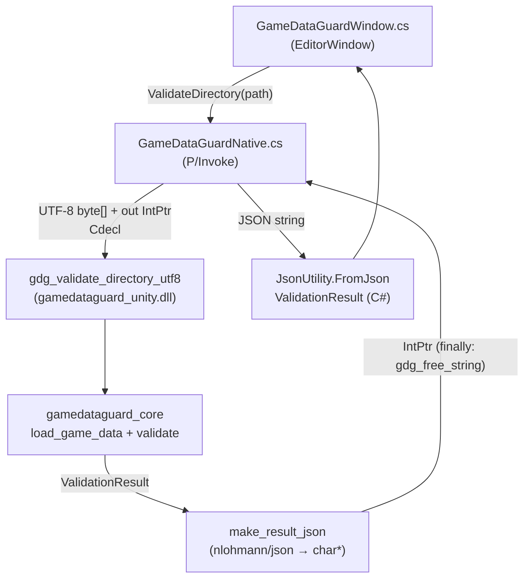

# GameDataGuard — Architecture

> For a high-level overview and screenshots, see the [README](../README.md).
> For the complete diagnostic code table, see [validation-reference.md](validation-reference.md).

---

## Component Responsibilities

### `DataLoader` (data_loader.hpp / data_loader.cpp)

- Opens and reads all required data files from a directory.
- Parses JSON using nlohmann/json.
- Returns either a `LoadSuccess` (populated `GameData`) or a `LoadError` (message string).
- A `LoadError` signals that processing cannot continue (missing required file, malformed JSON).
- Missing localization files are **not** a `LoadError`; they are deferred to the validator.
- Does not perform cross-reference or semantic validation.

### `DataModel` (data_model.hpp)

- Plain data structures: `Npc`, `Item`, `Quest`, `Manifest`, `GameData`.
- No methods or invariants; purely value types.

### `Diagnostic` (diagnostic.hpp / diagnostic.cpp)

- A single structured diagnostic: severity, stable code, file, optional JSON path, message.
- `operator<` defines deterministic sort order: severity → file → path → code.

### `ValidationResult` (validation_result.hpp / validation_result.cpp)

- A collection of `Diagnostic` objects with convenience methods (`error_count`, `has_errors`, etc.).
- `sort()` applies the deterministic ordering.

### `Validator` (validator.hpp / validator.cpp)

- Accepts a `GameData` and returns a `ValidationResult`.
- Validates manifest, NPC, item, and quest fields.
- Calls `validate_quest_graph` for graph-level analysis.
- Calls `validate_localization` for key completeness and value checks.
- Does not print to stdout. Formatting is the CLI's responsibility.

### `QuestGraph` (quest_graph.hpp / quest_graph.cpp)

- Accepts the quest list and start quest IDs.
- Builds a sorted adjacency map from `next_quest_ids` (excluding self-references and unknown IDs).
- Detects cycles using iterative DFS with a `White/Gray/Black` coloring scheme.
- Detects unreachable quests via BFS from start quests.
- Appends diagnostics to a `ValidationResult` provided by the caller.

### `JsonReporter` (json_reporter.hpp / json_reporter.cpp)

- Writes a structured JSON report to a given path.
- Uses atomic write (temp file + rename).
- Formats the sorted diagnostic list directly from `ValidationResult`.

### `Packer` (packer.hpp / packer.cpp)

- Accepts a `GameData` (assumed already validated).
- Builds a canonical JSON payload with deterministic ordering.
- Writes the binary pack header + payload to a temp file, then renames atomically.
- Returns `std::optional<std::string>` — empty on success, error message on failure.

### `CLI` (cli.hpp / cli.cpp)

- Parses `argc/argv` into a `CliArgs` struct.
- Returns a `ParseResult` with an `ok` flag and error message.
- `print_help()` writes usage to stdout.
- Does not call any other component.

### `main.cpp`

- Orchestrates: parse args → load data → validate → (optionally) pack.
- Applies the `--warnings-as-errors` policy.
- Prints diagnostics and summary to stdout.
- Writes JSON report if requested.
- Returns the appropriate exit code.

---

## Unity Integration Layer

The following components exist on the `feature/unity-editor-integration` branch and are built only when `GDG_BUILD_UNITY_PLUGIN=ON` is passed to CMake.

### `gamedataguard_unity` (integrations/unity/native/)

**`gamedataguard_unity.h` / `gamedataguard_unity.cpp`** — C ABI bridge compiled as a Windows shared library (`gamedataguard_unity.dll`).

- Exports exactly two `extern "C"` functions:
  - `gdg_validate_directory_utf8(const char*, char**) → int32_t` — calls `load_game_data()` + `validate()` and serialises the result to a heap-allocated UTF-8 JSON string.
  - `gdg_free_string(char*)` — releases the heap-allocated string; safe to call with `nullptr`.
- All C++ exceptions are caught inside the native layer. Nothing propagates into managed code.
- The result JSON always contains `status`, `errorCount`, `warningCount`, `message`, and `diagnostics[]`. No field is ever JSON `null`; absent optional values use empty string or empty array.
- `severity` in the JSON is lower-case (`"error"`, `"warning"`, `"info"`) — independent of the upper-case format used by the CLI.
- Does not print to stdout. Does not touch any global state.
- The CMake target `gamedataguard_unity` links `gamedataguard_core` as a static dependency. Only this bridge target is built as a DLL; the core remains static.

**Memory contract:** result strings are allocated with `new char[]` and released by `gdg_free_string` via `delete[]`.

### `GameDataGuardNative.cs` (P/Invoke wrapper)

- Declares the two `DllImport` signatures with `CallingConvention.Cdecl`.
- The directory path is passed as `byte[]` (UTF-8 encoded, explicit `\0` terminator) to avoid relying on `CharSet.Ansi` and the system code page. This is required for non-ASCII paths and works across both Mono and IL2CPP scripting backends.
- The native `IntPtr` (result string pointer) is always released in a C# `finally` block — unconditionally, regardless of exceptions or early returns.
- Every exception type at the interop boundary (`DllNotFoundException`, `EntryPointNotFoundException`, `BadImageFormatException`, and a general catch-all) is caught and returned as a `tool_error` result. `ValidateDirectory` never throws.

### `GameDataGuardModels.cs` (C# data models)

- `[Serializable] ValidationResult` — maps to the native JSON schema; deserialized via `JsonUtility.FromJson<T>`.
- `[Serializable] ValidationDiagnostic` — exposes a computed `Severity` enum parsed from the lower-case string field.
- Computed properties: `IsPassed`, `IsValidationFailed`, `IsToolError`.

### `GameDataGuardWindow.cs` (Unity EditorWindow)

- Opened via **Tools → GameDataGuard**; does not require Play Mode.
- `OnGUI()` renders: directory path field + folder-picker button, Validate + Clear buttons, status banner, scrollable diagnostic list.
- **Validate** is disabled until a non-empty path is entered.
- Calls `GameDataGuardNative.ValidateDirectory(path)`, then displays the returned `ValidationResult`.
- Presentation logic stays entirely in C#; the core has no knowledge of Unity types or IMGUI.

### `copy_plugin.ps1` (deploy script)

- Copies `build/<Config>/gamedataguard_unity.dll` to `Assets/Plugins/x86_64/`.
- Warns if a Unity lock file is detected (Unity should be closed before copying).
- Parameters: `-Configuration` (default `Release`), `-BuildDir` (default `build`).

---

## Data Flow

### CLI flow

```
argv
  │
  ▼
parse_args()         → CliArgs
  │
  ▼
load_game_data()     → LoadResult
  │             └── LoadError → exit 2
  ▼ LoadSuccess
validate()           → ValidationResult
  │
  ├── has_errors? ──→ print + exit 1 (no pack created)
  │
  ▼ (build command only)
write_pack()         → optional<string>
  │             └── error → exit 2
  │
  ▼
write_json_report()  → bool (if --report supplied)
  │
  ▼
exit 0
```

### Unity EditorWindow flow

```
GameDataGuardWindow.cs
  │  ValidateDirectory(path)
  ▼
GameDataGuardNative.cs  ── P/Invoke (Cdecl, UTF-8 byte[]) ──▶  gdg_validate_directory_utf8
                                                                   │
                                                                   ▼
                                                           load_game_data() + validate()
                                                                   │
                                                                   ▼ ValidationResult (C++)
                                                           make_result_json()  → char* (new char[])
                                                                   │
  ◀── IntPtr → byte[] → string ──────────────────────────────────┘
  │   finally: gdg_free_string(ptr)
  ▼
JsonUtility.FromJson<ValidationResult>
  │
  ▼
GameDataGuardWindow.cs  →  DrawSummaryBanner() + DrawDiagnosticList()
```

---

## Validation Flow

```
validate(GameData) {
    build NPC/item/quest ID sets

    validate_manifest()         GDG002, GDG004, GDG005
    validate_npcs()             GDG004, GDG005, GDG008
    validate_items()            GDG004, GDG005, GDG008, GDG012
    validate_quests_fields()    GDG004, GDG005, GDG006, GDG007, GDG017
    validate_manifest_start_quests()  GDG004, GDG016
    validate_quest_graph()      GDG013, GDG014
    validate_localization()     GDG009, GDG010, GDG011, GDG015

    result.sort()
    return result
}
```

---

## Build Flow (build command)

```
1. load_game_data()        — parse all JSON files
2. validate()              — run all validation rules
3. if errors (or warnings with --warnings-as-errors):
       print diagnostics + summary
       if --report: write_json_report()
       exit 1
4. write_pack()            — build canonical JSON payload, write binary pack
5. if --report: write_json_report()
6. exit 0
```

---

## Mermaid Diagram

### CLI


### Unity integration



---

## Important Design Decisions

### Deterministic output

Repeated builds of identical input must produce byte-identical pack files. This matters for:
- Build system caching (avoid redundant downstream processing)
- Diffing pack files between builds
- Reproducible build verification

Determinism is achieved by:
- Using `std::map` (sorted by key) for localization data
- Sorting NPCs, items, and quests by ID before writing
- Sorting all list fields (`required_locales`, `start_quest_ids`, `reward_item_ids`, `next_quest_ids`)
- Using `json::dump()` without indentation to avoid whitespace variance
- Writing integer fields in defined little-endian byte order

### Separation of validation from packaging

The validator has no knowledge of the packer, and the packer has no knowledge of validation rules. `main.cpp` is the only place that knows both. This means:
- Validation can be tested without a filesystem
- The packer can be tested with pre-validated data
- The rules can be changed without touching the binary format code

### `LoadResult` vs. validation diagnostics

Some failures (missing required file, malformed JSON) prevent any further processing. These are represented as `LoadError` and cause exit code 2. Content-level problems (wrong IDs, bad references) are represented as `Diagnostic` objects and cause exit code 1. This distinction is important: a malformed JSON file is a tool/input failure, not a content validation failure.

### Atomic file writing

Both the JSON reporter and the packer write to a `.tmp` file and rename atomically. This means a partially-written file will never appear at the intended path even if the process is interrupted.

### C-compatible ABI for the Unity plugin

Exporting `extern "C"` functions eliminates C++ name mangling and ABI fragility across compiler versions, STL implementations, and C++ runtimes. The ABI surface is intentionally minimal: one validation function and one free function. All C++ types, exceptions, and allocators stay behind this boundary.

### JSON as the cross-language result type

Rather than trying to expose `ValidationResult` as a C struct or flatten it into separate out-parameters, the bridge serialises the result to a JSON string. This keeps the C# side simple (one `JsonUtility.FromJson` call), avoids manual field marshaling, and means the result schema can be extended without changing the exported function signature.

### `JsonUtility` constraints drive the JSON schema

Unity's `JsonUtility.FromJson<T>` does not handle JSON `null`, optional fields, or polymorphic objects. The native JSON schema is designed so that all fields are always present: `path` is always a string (empty when no pointer applies), `diagnostics` is always an array (empty on success), and `message` is always a string (empty when unused). This removes all null-safety concerns from the C# layer.

### No global state in the validation core

All state is parameter-passed or locally owned. This makes the validation functions safe to call repeatedly from any context — including repeated calls in the Unity bridge test suite, which verifies that no state leaks between invocations.
