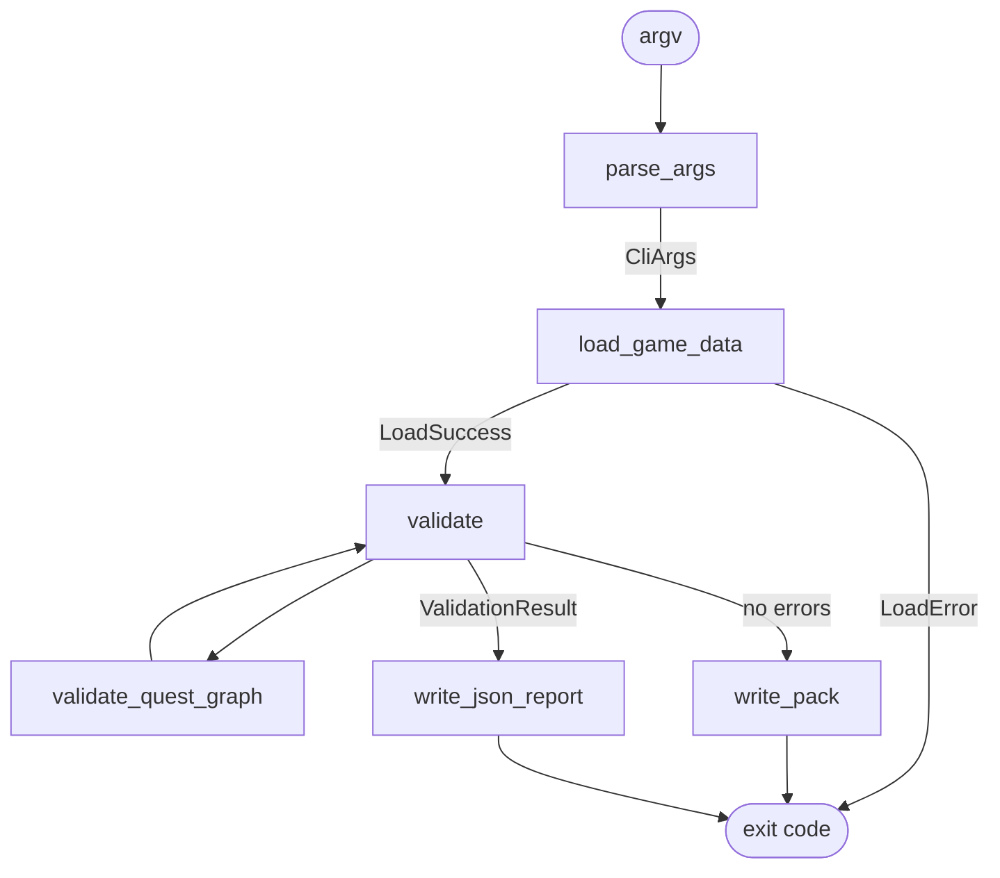

# GameDataGuard — Architecture

## Component Responsibilities

### `DataLoader` (data_loader.hpp / data_loader.cpp)

- Opens and reads all required data files from a directory.
- Parses JSON using nlohmann/json.
- Returns either a `LoadSuccess` (populated `GameData`) or a `LoadError` (message string).
- A `LoadError` signals that processing cannot continue (missing required file, malformed JSON).
- Missing localization files are **not** a `LoadError`; they are deferred to the validator.
- Does not perform cross-reference or semantic validation.

### `DataModel` (data_model.hpp)

- Plain data structures: `Npc`, `Item`, `Quest`, `Manifest`, `GameData`.
- No methods or invariants; purely value types.

### `Diagnostic` (diagnostic.hpp / diagnostic.cpp)

- A single structured diagnostic: severity, stable code, file, optional JSON path, message.
- `operator<` defines deterministic sort order: severity → file → path → code.

### `ValidationResult` (validation_result.hpp / validation_result.cpp)

- A collection of `Diagnostic` objects with convenience methods (`error_count`, `has_errors`, etc.).
- `sort()` applies the deterministic ordering.

### `Validator` (validator.hpp / validator.cpp)

- Accepts a `GameData` and returns a `ValidationResult`.
- Validates manifest, NPC, item, and quest fields.
- Calls `validate_quest_graph` for graph-level analysis.
- Calls `validate_localization` for key completeness and value checks.
- Does not print to stdout. Formatting is the CLI's responsibility.

### `QuestGraph` (quest_graph.hpp / quest_graph.cpp)

- Accepts the quest list and start quest IDs.
- Builds a sorted adjacency map from `next_quest_ids` (excluding self-references and unknown IDs).
- Detects cycles using iterative DFS with a `White/Gray/Black` coloring scheme.
- Detects unreachable quests via BFS from start quests.
- Appends diagnostics to a `ValidationResult` provided by the caller.

### `JsonReporter` (json_reporter.hpp / json_reporter.cpp)

- Writes a structured JSON report to a given path.
- Uses atomic write (temp file + rename).
- Formats the sorted diagnostic list directly from `ValidationResult`.

### `Packer` (packer.hpp / packer.cpp)

- Accepts a `GameData` (assumed already validated).
- Builds a canonical JSON payload with deterministic ordering.
- Writes the binary pack header + payload to a temp file, then renames atomically.
- Returns `std::optional<std::string>` — empty on success, error message on failure.

### `CLI` (cli.hpp / cli.cpp)

- Parses `argc/argv` into a `CliArgs` struct.
- Returns a `ParseResult` with an `ok` flag and error message.
- `print_help()` writes usage to stdout.
- Does not call any other component.

### `main.cpp`

- Orchestrates: parse args → load data → validate → (optionally) pack.
- Applies the `--warnings-as-errors` policy.
- Prints diagnostics and summary to stdout.
- Writes JSON report if requested.
- Returns the appropriate exit code.

---

## Data Flow

```
argv
  │
  ▼
parse_args()         → CliArgs
  │
  ▼
load_game_data()     → LoadResult
  │             └── LoadError → exit 2
  ▼ LoadSuccess
validate()           → ValidationResult
  │
  ├── has_errors? ──→ print + exit 1 (no pack created)
  │
  ▼ (build command only)
write_pack()         → optional<string>
  │             └── error → exit 2
  │
  ▼
write_json_report()  → bool (if --report supplied)
  │
  ▼
exit 0
```

---

## Validation Flow

```
validate(GameData) {
    build NPC/item/quest ID sets

    validate_manifest()         GDG002, GDG004, GDG005
    validate_npcs()             GDG004, GDG005, GDG008
    validate_items()            GDG004, GDG005, GDG008, GDG012
    validate_quests_fields()    GDG004, GDG005, GDG006, GDG007, GDG017
    validate_manifest_start_quests()  GDG004, GDG016
    validate_quest_graph()      GDG013, GDG014
    validate_localization()     GDG009, GDG010, GDG011, GDG015

    result.sort()
    return result
}
```

---

## Build Flow (build command)

```
1. load_game_data()        — parse all JSON files
2. validate()              — run all validation rules
3. if errors (or warnings with --warnings-as-errors):
       print diagnostics + summary
       if --report: write_json_report()
       exit 1
4. write_pack()            — build canonical JSON payload, write binary pack
5. if --report: write_json_report()
6. exit 0
```

---

## Mermaid Diagram



---

---

## Unity Editor Integration Layer

The optional `gamedataguard_unity` shared library adds a fourth layer on top of
`gamedataguard_core` for use as a Unity Editor tool.

```
Unity EditorWindow  (GameDataGuardWindow.cs)
        │
        ▼
C# interop wrapper  (GameDataGuardNative.cs)
        │  P/Invoke  CallingConvention.Cdecl
        ▼
C ABI  (gamedataguard_unity.dll)
  gdg_validate_directory_utf8()
  gdg_free_string()
        │
        ▼
gamedataguard_core  (static library)
  load_game_data() → LoadResult
  validate()       → ValidationResult
```

**Why a C ABI?**
The Unity Editor calls native code through P/Invoke, which requires a stable C
linkage.  C++ names are mangled and C++ object layouts are compiler-specific.
Wrapping the C++ core in a plain `extern "C"` layer with fixed-width integer
types and UTF-8 char pointers provides a stable, compiler-independent surface.

**Memory ownership**
`gdg_validate_directory_utf8` allocates the result JSON string with `new char[]`.
The C# wrapper always releases it in a `finally` block using `gdg_free_string`.
Nothing else crosses the ABI boundary: no STL types, no C++ exceptions, no
shared ownership.

**Exceptions**
All C++ exceptions are caught at the boundary and converted to a `tool_error`
JSON result.  The Unity Editor process is never at risk from a native exception.

**JSON schema**
The bridge returns a richer JSON schema than the file-based `JsonReporter`
because the Unity caller needs to display structured diagnostics without writing
a file:

```json
{
  "status":       "passed | validation_failed | tool_error",
  "errorCount":   0,
  "warningCount": 0,
  "message":      "",
  "diagnostics":  [
    { "severity": "error", "code": "GDG006",
      "file": "quests.json", "path": "/0/giver_npc_id",
      "message": "Referenced NPC does not exist." }
  ]
}
```

Severity strings are lower-case in the bridge JSON (unlike the CLI reporter
which uses upper-case) to match idiomatic JSON conventions used by Unity's
`JsonUtility` deserialiser.

The `path` field is always present as a string; an absent optional path in the
C++ `Diagnostic` struct is represented as an empty string so that Unity's
`JsonUtility` does not have to handle JSON `null` values.

---

## Important Design Decisions

### Deterministic output

Repeated builds of identical input must produce byte-identical pack files. This matters for:
- Build system caching (avoid redundant downstream processing)
- Diffing pack files between builds
- Reproducible build verification

Determinism is achieved by:
- Using `std::map` (sorted by key) for localization data
- Sorting NPCs, items, and quests by ID before writing
- Sorting all list fields (`required_locales`, `start_quest_ids`, `reward_item_ids`, `next_quest_ids`)
- Using `json::dump()` without indentation to avoid whitespace variance
- Writing integer fields in defined little-endian byte order

### Separation of validation from packaging

The validator has no knowledge of the packer, and the packer has no knowledge of validation rules. `main.cpp` is the only place that knows both. This means:
- Validation can be tested without a filesystem
- The packer can be tested with pre-validated data
- The rules can be changed without touching the binary format code

### `LoadResult` vs. validation diagnostics

Some failures (missing required file, malformed JSON) prevent any further processing. These are represented as `LoadError` and cause exit code 2. Content-level problems (wrong IDs, bad references) are represented as `Diagnostic` objects and cause exit code 1. This distinction is important: a malformed JSON file is a tool/input failure, not a content validation failure.

### Atomic file writing

Both the JSON reporter and the packer write to a `.tmp` file and rename atomically. This means a partially-written file will never appear at the intended path even if the process is interrupted.
